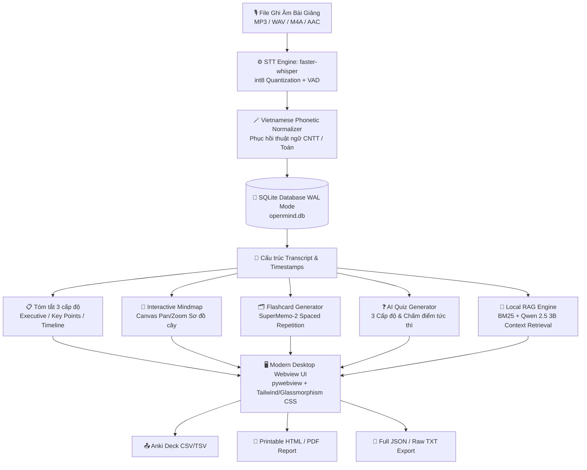

<div align="center">

# 🧠 Open-mind
### *Offline AI-Powered Academic Lecture Copilot & Active Recall Learning Workspace*

<p align="center">
  <b>Biến mọi file ghi âm bài giảng thành hệ sinh thái học tập thông minh — 100% On-Device, Bảo mật tuyệt đối & Không cần kết nối Internet.</b>
</p>

[](LICENSE)
[](https://www.python.org/)
[](#)
[](https://github.com/SYSTRAN/faster-whisper)
[](https://github.com/ggerganov/llama.cpp)
[](#)
[](#)

[Khởi động nhanh](#-hướng-dẫn-cài-đặt--khởi-chạy-quick-start) •
[Cài đặt từ mã nguồn](docs/BUILDING.md) •
[Kiến trúc hệ thống](docs/architecture.md) •
[Đặc tả API](docs/api.md) •
[Lịch sử thay đổi (Changelog)](CHANGELOG.md) •
[Thư viện phụ thuộc](docs/DEPENDENCIES.md) •
[Đóng góp & Báo lỗi](CONTRIBUTING.md)

</div>

---

## 📖 Giới thiệu (Overview)

**Open-mind** là ứng dụng trợ lý học tập AI cục bộ chuyên sâu (Local AI Copilot) dành cho sinh viên, nghiên cứu sinh, giảng viên và người tự học. 

Khác biệt hoàn toàn với các giải pháp đám mây (Cloud AI) tiềm ẩn rủi ro lộ lọt dữ liệu và chi phí API đắt đỏ, Open-mind mang toàn bộ sức mạnh của các mô hình AI tiên tiến nhất hiện nay (**faster-whisper** & **Qwen 2.5 3B Instruct**) trực tiếp về máy tính cá nhân của bạn.

Hệ thống cung cấp một quy trình khép kín: từ chuyển đổi âm thanh bài giảng thô thành văn bản có mốc thời gian (*Timestamps*), phục hồi thuật ngữ chuyên ngành tiếng Việt/Anh (*Code-switching*), tóm tắt phân cấp & sinh sơ đồ tư duy (*Mindmap*), trắc nghiệm tự động (*AI Quiz*), hệ thống thẻ ghi nhớ lặp lại ngắt quãng (*Spaced Repetition SM-2*), đến hỏi đáp tra cứu ngữ cảnh trực tiếp trên bài giảng (*Local RAG*).

---

## 🏗️ Kiến trúc Hệ thống (Architecture)



---

## ✨ Tính năng Cốt lõi (Key Features)

### 🎙️ 1. Nhận diện Giọng nói & Chuẩn hóa Thuật ngữ (Speech-to-Text)
- **Tối ưu hóa đa mô hình:** Hỗ trợ linh hoạt từ `tiny` (~75MB), `base` (~145MB), `small` (~460MB) đến `medium` (~1.5GB) với cơ chế int8 quantization trên CPU/GPU.
- **Phục hồi ngữ âm chuyên ngành (Code-switching Engine):** Tự động phát hiện và chuyển đổi các từ phát âm tiếng Việt bồi sang thuật ngữ chuẩn quốc tế (VD: *"mờ đê năm"* ➔ `MD5`, *"ét hát a hai năm sáu"* ➔ `SHA-256`, *"ét quy eo"* ➔ `SQL`, *"chây sơn"* ➔ `JSON`, *"ô ô pi"* ➔ `OOP`, `TCP/IP`, `Docker`, `Interface`,...).
- **Đồng bộ đa phương tiện:** Trình phát Audio tích hợp tua trực tiếp theo từng phân đoạn câu `[MM:SS]` kèm hiển thị Waveform.

### 📑 2. Tóm tắt Phân cấp & Sơ đồ Tư duy (Hierarchical Summary & Mindmap)
- **Cấu trúc sư phạm 3 tầng:**
  1. *Tóm tắt Tổng quan (Executive Summary):* Khái quát tinh thần bài học.
  2. *Ý chính Cốt lõi (Key Takeaways):* Liệt kê luận điểm trọng tâm.
  3. *Chi tiết theo Mốc thời gian:* Đối chiếu nội dung bám sát từng khoảng thời gian bài giảng.
- **Interactive Mindmap Canvas:** Tự động trực quan hóa bài giảng thành sơ đồ phân nhánh kiến thức, hỗ trợ kéo rê (pan), phóng to/thu nhỏ (zoom) và thu gọn/mở rộng nhánh.

### 🗂️ 3. Thẻ Ghi nhớ Thông minh & Thuật toán SM-2 (Spaced Repetition)
- **Tự động trích xuất cặp khái niệm:** Tạo bộ Flashcards hoàn chỉnh có câu hỏi độc lập ngữ cảnh (*Self-contained*), không sử dụng đại từ mơ hồ.
- **Thuật toán SuperMemo-2 (SM-2):** Tối ưu hóa chu kỳ nhớ dài hạn với 4 cấp độ phản hồi (*Again*, *Hard*, *Good*, *Easy*), tự động tính toán hệ số ghi nhớ (*Ease Factor*), khoảng cách ngày (*Interval*) và quản lý hàng đợi *Due Today*.

### ❓ 4. Ngân hàng Trắc nghiệm Tự động (AI Quiz Generator)
- Tự động sinh đề kiểm tra 4 lựa chọn theo 3 mức độ nhận thức: **Dễ (Nhận biết)**, **Trung bình (Thông hiểu)**, **Khó (Vận dụng/Phân tích)**.
- Giao diện làm bài trực quan, chấm điểm tức thì kèm lời giải thích chi tiết cho từng phương án. Lưu trữ lịch sử các lần thi vào database.

### 💬 5. Trợ lý Hỏi-Đáp Ngữ cảnh Bài giảng (Local RAG Copilot)
- Sử dụng mô hình **Qwen 2.5 3B Instruct** chạy hoàn toàn trên máy cục bộ qua `llama.cpp`.
- Cơ chế **Sliding-window Chunking & BM25 Scoring** trích xuất ngữ cảnh liên quan nhất, trả lời chính xác kèm dẫn chứng mốc thời gian `[MM:SS]` để đối chiếu âm thanh gốc.

### 📊 6. Bảng điều khiển Tiến độ (Study Analytics)
- Thống kê chuỗi ngày học liên tục (*Daily Streak*), tổng thời gian học tập, tổng số thẻ cần ôn trong ngày và biểu đồ phân bổ học tập 7 ngày gần nhất.

### 📤 7. Xuất Dữ liệu Đa Định dạng (Export Engine)
- **Anki Deck (`.csv` / `.tsv`):** Nhập trực tiếp vào phần mềm Anki Desktop/Mobile.
- **Báo cáo học thuật (`.html`):** Thiết kế sẵn sàng in ấn hoặc lưu PDF chất lượng cao.
- **Dữ liệu thô:** Xuất bản ghi `.txt` hoặc gói dữ liệu đầy đủ `.json`.

---

## 🔬 Thuật toán Cốt lõi (Core Algorithms)

### 1. Thuật toán Lặp lại Ngắt quãng SuperMemo-2 (SM-2)
Hệ số ghi nhớ ($EF$) và khoảng thời gian ôn tập kế tiếp ($I$) được tính toán theo công thức:

$$EF' = \max\left(1.3, \; EF + \left(0.1 - (5 - q) \times (0.08 + (5 - q) \times 0.02)\right)\right)$$

$$I(n) = \begin{cases} 
1 & \text{khi } n = 1 \\ 
6 & \text{khi } n = 2 \\ 
\lceil I(n-1) \times EF' \rceil & \text{khi } n > 2 \text{ và } q \ge 3 
\end{cases}$$

*(Trong đó $q \in \{1, 3, 4, 5\}$ tương ứng với Again, Hard, Good, Easy; khi $q < 3$, chuỗi ôn tập được thiết lập lại từ đầu).*

### 2. Bộ lọc Ngữ cảnh BM25 (Hybrid Chunking & Retrieval)
Phân đoạn bài giảng thành các chunks linh hoạt $\approx 60\text{s}$, sau đó xếp hạng độ tương quan câu hỏi bằng công thức BM25:

$$\text{Score}(D, Q) = \sum_{i=1}^{N} \text{IDF}(q_i) \cdot \frac{f(q_i, D) \cdot (k_1 + 1)}{f(q_i, D) + k_1 \cdot \left(1 - b + b \cdot \frac{|D|}{\text{avgdl}}\right)}$$

---

## 📊 Bảng So sánh Mô hình STT (Benchmarks)

Được đo lường trên bài giảng CNTT tiếng Việt thực tế (Thời lượng: 10 phút, CPU Intel Core i5 8 nhân, RAM 16GB):

| Model | Dung lượng | Tốc độ RTF* | RAM Đỉnh | Độ chính xác tiếng Việt & Thuật ngữ | Khuyến nghị |
|:---|:---|:---|:---|:---|:---|
| **Tiny** | ~75 MB | **~0.10x (10x)** | ~450 MB | Cơ bản, dễ nhầm thuật ngữ | Máy RAM $\le$ 4GB |
| **Base** | ~145 MB | **~0.16x (6x)** | ~700 MB | Tốt với câu thông dụng | Máy văn phòng nhẹ |
| **Small** | **~460 MB** | **~0.33x (3x)** | **~1.2 GB** | **Rất cao, bắt chuẩn thuật ngữ CNTT** | **⭐ Mặc định khuyên dùng** |
| **Medium** | ~1.5 GB | **~0.95x (1x)** | ~3.1 GB | Hoàn hảo nhất, độ trễ cao hơn | Máy cấu hình mạnh |

*\*RTF (Real-Time Factor): Thời gian xử lý / Thời lượng âm thanh. RTF < 1.0 nghĩa là xử lý nhanh hơn thời gian thực phát âm thanh.*

---

## 💻 Yêu cầu Hệ thống (System Requirements)

| Tiêu chí | Cấu hình Tối thiểu | Cấu hình Đề xuất |
|:---|:---|:---|
| **Hệ điều hành** | Windows 10/11 (64-bit), Ubuntu 20.04+, macOS 12+ | Windows 11 / macOS (Apple Silicon M1/M2/M3) / Linux |
| **Bộ xử lý (CPU)** | Intel Core i3 / AMD Ryzen 3 (4 Cores) | Intel Core i5/i7, AMD Ryzen 5/7 hoặc Apple Silicon |
| **Bộ nhớ RAM** | 6 GB RAM | 8 GB – 16 GB RAM |
| **Ổ cứng** | 5 GB khả dụng (lưu Model AI & Database) | 10 GB SSD khả dụng |
| **Internet** | Chỉ dùng để tải model AI ở lần chạy đầu tiên | **100% Offline** trong toàn bộ quá trình sử dụng |

---

## 🚀 Hướng dẫn Cài đặt & Khởi chạy (Quick Start)

Open-mind tích hợp cơ chế **tự động hóa toàn diện**: tự tạo môi trường ảo Python `venv`, tự cài đặt `requirements.txt`, tự tải các model AI và nạp dữ liệu mẫu ban đầu nếu máy chưa có.

### Cách 1: Khởi chạy 1-Click (Khuyên dùng)

- **Trên Windows:** Nhấp đúp chuột vào file [`run.bat`](run.bat) (hoặc gõ `.\run.bat` trong CMD/PowerShell).
- **Trên Linux / macOS:** Mở Terminal và chạy:
  ```bash
  chmod +x run.sh
  ./run.sh
  ```

### Cách 2: Khởi chạy Thủ công bằng Python

```bash
# 1. Clone mã nguồn dự án
git clone https://github.com/dargits/Openmind.git
cd Openmind

# 2. Tạo và kích hoạt môi trường ảo
python -m venv venv

# Windows:
venv\Scripts\activate
# Linux / macOS:
source venv/bin/activate

# 3. Cài đặt các thư viện phụ thuộc
pip install --upgrade pip
pip install -r requirements.txt

# 4. Khởi chạy ứng dụng
python main.py
```

> [!TIP]
> **Tự động tải Model:** Trong lần khởi chạy đầu tiên, ứng dụng sẽ tự động tải `faster-whisper-small` (~460MB) và `Qwen2.5-3B-Instruct-Q4_K_M.gguf` (~2.0GB) về thư mục `models/`. Sau đó, ứng dụng sẽ tự động kích hoạt cờ `HF_HUB_OFFLINE=1` để hoạt động hoàn toàn không cần Internet.

---

## 🗂️ Cấu trúc Mã nguồn (Repository Structure)

```text
Open-mind/
├── 📁 core/                         # Toàn bộ lõi ứng dụng & nghiệp vụ AI
│   ├── __init__.py                 # Khởi tạo package core, export các engine chính
│   ├── config.py                   # Cấu hình hệ thống, tham số model & hardware
│   ├── database.py                 # Data Access Layer SQLite (WAL Mode, CRUD)
│   ├── api.py                      # Cầu nối API hai chiều Python ↔ Javascript (pywebview)
│   ├── demo_seeder.py              # Logic nạp bài giảng mẫu ban đầu
│   ├── stt_engine.py               # Engine Whisper STT & Bộ chuẩn hóa ngữ âm tiếng Việt
│   ├── llm_engine.py               # Engine Qwen 2.5 LLM & TranscriptPruner
│   ├── rag_engine.py               # Sliding-window Chunking & BM25 Context Retrieval
│   ├── flashcard_srs.py            # Triển khai thuật toán SuperMemo-2 (SM-2)
│   ├── export_engine.py            # Xuất dữ liệu ra TXT, JSON, Anki CSV, HTML Report
│   └── model_manager.py            # Quản lý kiểm tra & tải Model AI tự động
├── 📁 docs/                         # Trung tâm tài liệu kỹ thuật chuyên sâu (Documentation Hub)
│   ├── README.md                   # Cổng điều hướng & mục lục tài liệu kỹ thuật
│   ├── architecture.md             # Sơ đồ & phân tích kiến trúc hệ thống đa tầng
│   ├── api.md                      # Đặc tả các RESTful API endpoints của hệ thống
│   ├── BUILDING.md                 # Hướng dẫn chi tiết biên dịch & cài đặt từ mã nguồn
│   ├── DEPENDENCIES.md             # Báo cáo thư viện phụ thuộc & ma trận giấy phép
│   └── the-le-cuoc-thi-2026.pdf    # Thể lệ cuộc thi Phát triển PMMN tích hợp AI 2026
├── 📁 ui/                           # Giao diện người dùng Webview hiện đại (SPA)
│   ├── css/style.css               # Design System hiện đại, responsive & glassmorphism
│   ├── js/                         # Logic giao diện & tương tác người dùng
│   ├── logo.jpg                    # Logo thương hiệu ứng dụng
│   └── index.html                  # Cấu trúc giao diện Webview chính
├── 📁 data/                         # Thư mục lưu trữ dữ liệu người dùng (100% Offline)
│   ├── demo_lecture.json           # Dữ liệu học tập mẫu hoàn chỉnh
│   ├── openmind.db                 # Database SQLite người dùng (Tự sinh)
│   ├── settings.json               # Cấu hình người dùng cá nhân (Tự sinh)
│   └── .gitkeep
├── 📁 models/                       # Thư mục lưu trữ trọng số mô hình AI (Offline)
│   └── README.md                   # Hướng dẫn chi tiết tải thủ công mô hình
├── 📁 scripts/                      # Kịch bản tự động hóa đóng gói & kiểm tra mã nguồn
│   ├── add_license_headers.py      # Tiện ích tự động gắn SPDX License Header
│   └── package_release.py          # Script đóng gói bản phát hành mở (.tar.gz & SHA256)
├── 📁 tests/                        # Bộ kiểm thử tự động & công cụ đo đạc
│   ├── __init__.py
│   ├── test_core.py                # Test Database CRUD, SM-2 SRS, RAG, Export, Pruner
│   └── benchmark_stt.py            # Đo đạc RTF, Peak RAM, WER của mô hình STT
├── 📁 .github/                      # Quy chuẩn cộng đồng & Bug Tracker
│   ├── ISSUE_TEMPLATE/             # Mẫu báo lỗi và yêu cầu tính năng
│   └── pull_request_template.md    # Mẫu đóng góp Pull Request
├── .env.example                    # Tệp cấu hình môi trường mẫu (Cấu hình trước khi chạy/dịch)
├── pyproject.toml                  # Khai báo cấu hình dự án & đóng gói chuẩn PEP 517/518/621
├── setup.py                        # Kịch bản cài đặt tương thích ngược (pip install -e .)
├── main.py                         # Entrypoint chính khởi chạy ứng dụng Desktop
├── requirements.txt                # Danh sách thư viện Python phụ thuộc
├── run.bat                         # Kịch bản khởi chạy 1-Click trên Windows
├── run.sh                          # Kịch bản khởi chạy 1-Click trên Linux/macOS
├── CHANGELOG.md                    # Lịch sử thay đổi mã nguồn (Keep a Changelog)
├── CONTRIBUTING.md                 # Hướng dẫn tiêu chuẩn đóng góp mã nguồn & Bug Tracker
├── LICENSE                         # Giấy phép mã nguồn mở MIT toàn văn & thông báo mục đích
└── README.md                       # Tài liệu tổng quan dự án
```

---

## 🧪 Kiểm thử & Bộ công cụ (Testing & Tools)

### 1. Chạy Bộ Kiểm thử Tự động (Unit Tests)
Dự án đi kèm bộ test toàn diện kiểm tra tính đúng đắn của Database, thuật toán SM-2, RAG Engine, TranscriptPruner và Export Engine:

```bash
python -m unittest tests/test_core.py -v
```

### 2. Đo đạc Hiệu năng STT (Benchmark Tool)
Đo đạc tốc độ xử lý (*Real-Time Factor*), dung lượng RAM tiêu thụ và tỷ lệ lỗi từ (*Word Error Rate - WER*) trên file âm thanh thực tế:

```bash
# Đo toàn bộ mô hình STT trên file audio mẫu
python tests/benchmark_stt.py --audio data/samples/lecture.mp3 --reference data/samples/lecture_ground_truth.txt

# Đo riêng mô hình tiny và small
python tests/benchmark_stt.py --audio data/samples/lecture.mp3 --models tiny,small
```

### 3. Nạp lại Dữ liệu Mẫu (Seed Demo Data)
```bash
python -m core.demo_seeder --force
```

---

## 🔒 Cam kết Quyền riêng tư & An toàn Dữ liệu (Privacy First)

- 🛡️ **100% Local Processing:** Toàn bộ file ghi âm giọng nói, bản ghi văn bản, câu hỏi trắc nghiệm và lịch sử học tập được lưu trữ duy nhất trên máy của bạn.
- 🚫 **Zero Telemetry / No Tracking:** Không gửi bất kỳ dữ liệu phân tích, telemetry hay cookie nào lên máy chủ bên ngoài.
- 🔌 **Air-Gapped Ready:** Sau khi tải mô hình, ứng dụng hoàn toàn có thể chạy trong môi trường ngắt kết nối Internet tuyệt đối (Air-gapped environment).

---

## 🗺️ Lộ trình Phát triển (Roadmap)

- [x] Tích hợp mô hình Whisper STT đa kích cỡ kèm bộ chuẩn hóa từ vựng CNTT tiếng Việt.
- [x] Triển khai LLM Qwen 2.5 3B Instruct chạy CPU/GPU nội bộ qua `llama.cpp`.
- [x] Xây dựng hệ thống ôn tập Spaced Repetition (SuperMemo-2) & Bộ sinh Quiz trắc nghiệm.
- [x] Sơ đồ tư duy tương tác (Interactive Mindmap Canvas) và xuất báo cáo Anki/HTML.
- [ ] Hỗ trợ nhận diện người nói (*Speaker Diarization*) phân biệt giảng viên và sinh viên.
- [ ] Tích hợp trích xuất công thức toán học LaTeX từ bài giảng.
- [ ] Hỗ trợ tải thêm tài liệu PDF/Slide bài giảng đi kèm để làm giàu ngữ cảnh cho RAG.

---

## 🤝 Đóng góp Phát triển & 🐛 Quản lý Lỗi (Contributing & Bug Tracker)

Chúng tôi hoan nghênh mọi đóng góp từ cộng đồng! Quy trình phát triển của Open-mind được quản lý công khai, minh bạch theo tiêu chuẩn nguồn mở:

- **Báo cáo lỗi phần mềm (Bug Tracker):** Nếu gặp lỗi hoặc sự cố khi chạy, vui lòng mở issue tại [**GitHub Issues Tracker**](https://github.com/dargits/Openmind/issues). Chúng tôi cung cấp sẵn biểu mẫu chuẩn [Bug Report](.github/ISSUE_TEMPLATE/bug_report.md) để hỗ trợ phản hồi nhanh nhất.
- **Đề xuất tính năng mới:** Sử dụng biểu mẫu [Feature Request](.github/ISSUE_TEMPLATE/feature_request.md) tại GitHub Issues.
- **Quy chuẩn đóng góp mã nguồn (Pull Request):**
  1. Fork repository tại `https://github.com/dargits/Openmind.git`
  2. Tạo nhánh tính năng (`git checkout -b feature/AmazingFeature`)
  3. Kiểm tra mã nguồn và chạy bộ test (`python -m unittest tests/test_core.py -v`)
  4. Đảm bảo các file mới có SPDX License Header (`SPDX-License-Identifier: MIT`)
  5. Commit thay đổi (`git commit -m 'feat: Add some AmazingFeature'`)
  6. Push lên nhánh (`git push origin feature/AmazingFeature`)
  7. Mở một **Pull Request** theo mẫu [PULL_REQUEST_TEMPLATE](.github/pull_request_template.md).

Chi tiết xem tại tài liệu [**CONTRIBUTING.md**](CONTRIBUTING.md).

---

## 📄 Giấy phép & Mục đích Cấp phép (License & Purpose Declaration)

Dự án **Open-mind** được cấp phép theo giấy phép mã nguồn mở **[MIT License](LICENSE)** được Tổ chức Sáng kiến Mã nguồn Mở (**OSI**) phê chuẩn.

### 🎯 Thông báo về Mục đích của Giấy phép (License Purpose Notice):
1. **Thúc đẩy Học thuật & Nghiên cứu Mở:** Giấy phép MIT trao quyền tự do tối đa cho sinh viên, giảng viên và các nhà nghiên cứu trong việc tiếp cận, nghiên cứu cơ chế hoạt động, tùy biến mô hình AI và phát triển các sản phẩm phái sinh mà không bị rào cản bản quyền.
2. **Quyền riêng tư 100% On-Device:** Đảm bảo giải pháp AI học tập hoàn toàn độc lập, phi thương mại hóa dữ liệu người dùng, hoạt động an toàn không phụ thuộc vào máy chủ đám mây của bên thứ ba.
3. **Tính Tương thích Hoàn hảo:** Giấy phép MIT có tính tương thích một chiều và hai chiều cao nhất với toàn bộ hệ sinh thái thư viện mã nguồn mở mà Open-mind sử dụng (`faster-whisper`, `llama.cpp`, `pywebview`, `PyTorch`, `Pygame`), loại trừ hoàn toàn nguy cơ xung đột bản quyền.

Toàn văn giấy phép được cung cấp tại tệp **[LICENSE](LICENSE)**. Báo cáo chi tiết giấy phép của các thư viện phụ thuộc có tại **[DEPENDENCIES.md](docs/DEPENDENCIES.md)**.

<div align="center">
  <sub>Xây dựng với ❤️ dành cho cộng đồng học tập & nghiên cứu. Nếu bạn thấy dự án hữu ích, hãy tặng <b>⭐ Star</b> trên GitHub!</sub>
</div>