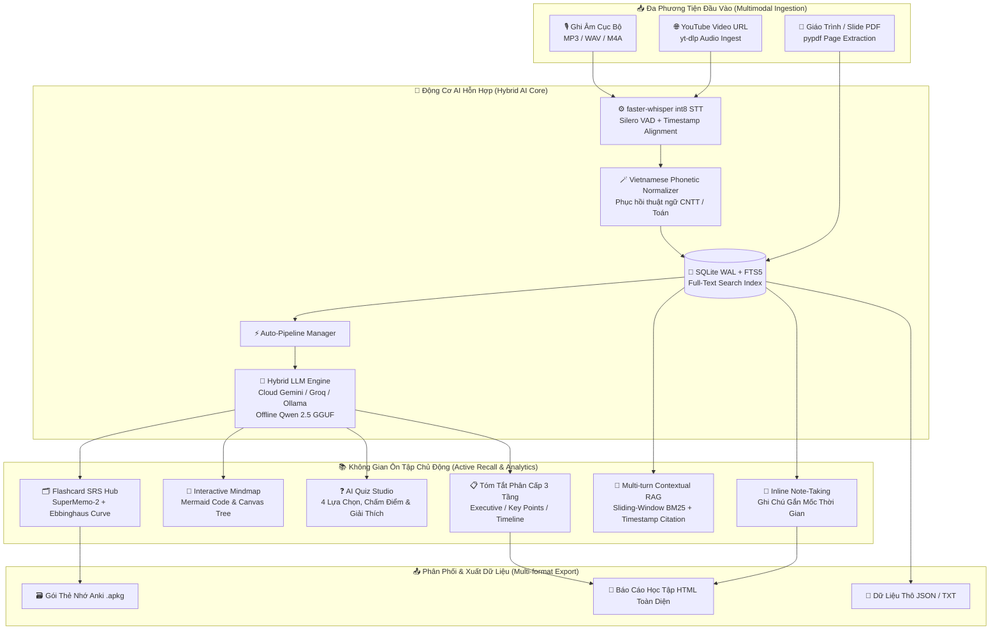

<div align="center">

# 🧠 Open-mind
### *Smart AI Lecture Copilot & Active Recall Learning Workspace*

<p align="center">
  <b>Biến file ghi âm bài giảng, video YouTube và slide PDF thành không gian học tập tương tác thông minh.</b><br>
  <i>Tự động tóm tắt, vẽ sơ đồ tư duy, tạo trắc nghiệm, luyện thẻ nhớ Ebbinghaus và trợ lý AI hỏi đáp trực tiếp trên bài học.</i>
</p>

[](LICENSE)
[](https://www.python.org/)
[-6366f1.svg?style=flat-square)](#-kiến-trúc-hybrid-ai--auto-fallback)
[](https://github.com/SYSTRAN/faster-whisper)
[](#-tính-năng-cốt-lõi)
[](#-kiểm-thử-tự-động-testing)

[Khởi động nhanh](#-khởi-động-nhanh-quick-start) •
[Tính năng cốt lõi](#-tính-năng-cốt-lõi) •
[Kiến trúc hệ thống](#-kiến-trúc-kỹ-thuật-system-architecture) •
[Thuật toán & Cơ sở khoa học](#-thuật-toán-cốt-lõi--cơ-sở-khoa-học) •
[Benchmarks](#-đo-đạc-thực-nghiệm-benchmarks) •
[Cấu hình AI](#-kiến-trúc-hybrid-ai--auto-fallback) •
[Tài liệu chi tiết](docs/)

</div>

---

## ⚡ Ứng dụng này giải quyết vấn đề gì?

Khi học tập và nghiên cứu, sinh viên thường ghi âm hàng chục giờ bài giảng nhưng **rất hiếm khi nghe lại** vì tốn thời gian tua tìm đoạn cần học. 

**Open-mind** giải quyết trọn vẹn việc này bằng quy trình học tập khép kín:
1. **Không cần nghe lại từ đầu đến cuối:** AI chuyển toàn bộ bài giảng thành văn bản có mốc thời gian `[MM:SS]`.
2. **Không tốn công soạn tài liệu:** Tự động sinh tóm tắt phân cấp, sơ đồ tư duy (Mindmap) và ngân hàng câu hỏi trắc nghiệm kèm lời giải.
3. **Ghi nhớ kiến thức dài hạn:** Tự động trích xuất thẻ Flashcards và áp dụng thuật toán lặp lại ngắt quãng (Spaced Repetition SM-2 & Đường cong quên lãng Ebbinghaus).

---

## ✨ Tính năng Cốt lõi

| Tính năng | Mô tả chi tiết |
|:---|:---|
| 🎙️ **Phiên âm giọng nói chuẩn xác** | Xử lý âm thanh ngay trên máy tính bằng `faster-whisper` (int8). Tự động nhận diện và sửa các từ phát âm tiếng Việt bồi sang thuật ngữ CNTT quốc tế (`MD5`, `SQL`, `JSON`, `OOP`, `TCP/IP`...). Bấm vào câu để tua âm thanh ngay lập tức. |
| ⚡ **Auto-Pipeline 4-trong-1** | Vừa nạp bài học xong, hệ thống tự động sinh 4 phần học tập: **Tóm tắt 3 cấp độ**, **Sơ đồ tư duy Canvas**, **Quiz trắc nghiệm 4 lựa chọn** và **Bộ thẻ nhớ Flashcard**. |
| 📥 **Nhập YouTube & Slide PDF** | Dán trực tiếp liên kết YouTube để tải bài giảng (`yt-dlp`), hoặc kéo thả file Slide thuyết trình / Giáo trình PDF (`pypdf`) để AI bóc tách nội dung theo từng trang. |
| 💬 **Trợ lý RAG hỏi-đáp bài giảng** | Chat trực tiếp với bài học. Trợ lý trả lời chính xác dựa trên lời giảng của thầy cô kèm dẫn chứng `[MM:SS]` để đối chiếu. Lưu trữ lịch sử hội thoại nhiều lượt. |
| 📝 **Ghi chú Inline theo mốc thời gian** | Vừa nghe vừa ghi chú gắn liền với giây hiện tại của bài giảng. Có chế độ lọc "Chỉ xem ghi chú" giúp ôn thi cấp tốc. |
| 🔍 **Tìm kiếm toàn văn tức thì** | Tìm kiếm từ khóa xuyên suốt toàn bộ kho bài giảng, phụ đề và ghi chú bằng công cụ SQLite FTS5 tốc độ cao (<5ms). |
| 🧠 **Khoa học ôn tập Ebbinghaus** | Biểu đồ dự báo số thẻ cần ôn trong 7 ngày tới theo công thức $R = 100 \times e^{-t/S}$. Hỗ trợ xuất trực tiếp bộ thẻ sang định dạng **Anki (`.apkg`)** và **Báo cáo học tập HTML**. |

---

## 🏗️ Kiến trúc Kỹ thuật (System Architecture)



---

## 🔬 Thuật toán Cốt lõi & Cơ sở Khoa học

### 1. Thuật toán Lặp lại Ngắt quãng SuperMemo-2 (SM-2)
Hệ số ghi nhớ ($EF$) và khoảng thời gian ôn tập kế tiếp ($I$) được tính toán tự động sau mỗi lượt trả lời:

$$EF' = \max\left(1.3, \; EF + \left(0.1 - (5 - q) \times (0.08 + (5 - q) \times 0.02)\right)\right)$$

$$I(n) = \begin{cases} 
1 & \text{khi } n = 1 \\ 
6 & \text{khi } n = 2 \\ 
\lceil I(n-1) \times EF' \rceil & \text{khi } n > 2 \text{ và } q \ge 3 
\end{cases}$$

*(Trong đó $q \in \{1, 2, 3, 4\}$ tương ứng với Again, Hard, Good, Easy; nếu $q < 3$, chuỗi ôn tập sẽ được reset về ngày 1).*

### 2. Mô hình Suy giảm Trí nhớ Hermann Ebbinghaus
Ước tính tỷ lệ kiến thức còn đọng lại trong não bộ ($R$) theo thời gian $t$ (ngày) dựa trên độ bền trí nhớ $S$:

$$R(t) = 100 \cdot \exp\left(-\frac{t}{\max(1.0, \; \text{reps} \cdot EF)}\right)$$

### 3. Thuật toán Xếp hạng Truy hồi Ngữ cảnh BM25 (Information Retrieval)
Đo lường mức độ tương quan giữa câu hỏi của người học ($Q$) và từng phân đoạn bài giảng ($D$):

$$\text{Score}(D, Q) = \sum_{i=1}^{N} \text{IDF}(q_i) \cdot \frac{f(q_i, D) \cdot (k_1 + 1)}{f(q_i, D) + k_1 \cdot \left(1 - b + b \cdot \frac{|D|}{\text{avgdl}}\right)}$$

---

## 📊 Đo đạc Thực nghiệm (Benchmarks)

Kiểm nghiệm thực tế trên bài giảng Công nghệ thông tin tiếng Việt (Thời lượng: 10 phút, CPU Intel Core i5 8 nhân, RAM 16GB):

| Model | Dung lượng | Tốc độ RTF* | RAM Đỉnh | Nhận diện Thuật ngữ CNTT | Khuyến nghị Phần cứng |
|:---|:---|:---|:---|:---|:---|
| **Tiny** | ~75 MB | **~0.10x (10x)** | ~450 MB | Cơ bản, dễ lẫn từ chuyên ngành | Máy RAM $\le$ 4GB |
| **Base** | ~145 MB | **~0.16x (6x)** | ~700 MB | Tốt với câu đàm thoại thông dụng | Laptop văn phòng nhẹ |
| **Small** | **~460 MB** | **~0.33x (3x)** | **~1.2 GB** | **Rất cao, bắt chuẩn thuật ngữ CNTT** | **⭐ Mặc định khuyên dùng** |
| **Medium** | ~1.5 GB | **~0.95x (1x)** | ~3.1 GB | Hoàn hảo nhất, độ trễ cao hơn | Máy trạm cấu hình cao |

*\*RTF (Real-Time Factor): Thời gian xử lý / Thời lượng âm thanh. RTF = 0.33 nghĩa là 1 giờ bài giảng được phiên âm chỉ trong 20 phút.*

---

## 🌐 Kiến trúc Hybrid AI & Auto-Fallback

Open-mind giải quyết bài toán cạn kiệt Quota API miễn phí thông qua **Cơ chế chuyển vùng dự phòng tự động (Auto-Fallback)**:

```
[Yêu cầu AI từ Người Dùng]
          │
          ▼
┌───────────────────────────┐
│ Google Gemini 2.0 Flash   │ ──(HTTP 429 Quota Exceeded)──┐
└───────────────────────────┘                               │
          │ (Thành công)                                    ▼
          │                                 ┌───────────────────────────┐
          │                                 │ Groq (Llama 3.3 70B)      │ ──(Lỗi/Hết Quota)──┐
          │                                 └───────────────────────────┘                     │
          │                                               │                                   ▼
          │                                               ▼                     ┌───────────────────────────┐
          │                                        (Thành công)                 │ Qwen 2.5 3B GGUF (Local)  │
          ▼                                                                     └───────────────────────────┘
[Trả kết quả ngay lập tức — Zero Downtime]
```

* **Cloud AI (Khuyên dùng):** Tốc độ phản hồi cực nhanh (1 - 3 giây). Tích hợp Google Gemini, Groq, OpenRouter và Ollama.
* **Local AI (100% Offline):** Tự động chuyển về mô hình nội bộ `Qwen 2.5 3B Instruct` (GGUF qua `llama-cpp-python`) khi mất mạng Internet.

---

## 🚀 Hướng dẫn Cài đặt & Khởi động (Installation & Quick Start)

### 📦 Cách 1: Tải Bản Cài Đặt Chính Thức (Khuyên dùng cho Người dùng phổ thông)

> [!TIP]
> Bạn **không cần cài đặt Python, không cần cấu hình dòng lệnh**! Tải bản phát hành chính thức đóng gói sẵn để cài đặt trong vài giây.

1. **Tải bộ cài đặt mới nhất**:
   Truy cập mục 👉 **[GitHub Releases - Open-mind Official Releases](https://github.com/dargits/Openmind/releases)**.

2. **Các tệp tải về có sẵn**:
   - 🪟 **Bản cài đặt Windows (Khuyên dùng)**: `OpenMind_Setup.exe` (~95 MB — Bản siêu nhẹ, tự động cấu hình Shortcut & Menu).
   - 📦 **Bản phát hành mã nguồn mở POSIX**: `openmind-v2.1.0.tar.gz` (1.22 MB) hoặc `openmind-v2.1.0.tar.xz` (0.95 MB).
   - 🔐 **Mã kiểm tra toàn vẹn**: `openmind-v2.1.0-SHA256SUMS.txt`.

3. **Tiến hành cài đặt & Sử dụng**:
   - Nhấp đúp vào file `OpenMind_Setup.exe` vừa tải về.
   - Nhấn **Next** $\rightarrow$ **Install** để hoàn tất cài đặt (Tự động tạo biểu tượng ngoài Desktop).
   - Mở ứng dụng **Open-mind**: Ứng dụng đã được tích hợp sẵn khóa Gemini AI Cloud tốc độ cao và tự động nạp mô hình STT Whisper Small trên màn hình Splash Screen ngay lần đầu tiên mở ứng dụng.

---

### ⚡ Cách 2: Chạy 1-Click Trực Tiếp từ Mã Nguồn
Dành cho người dùng muốn chạy trực tiếp thư mục repo mà không cần cài đặt phần mềm:
- **Trên Windows:** Nhấp đúp vào file [`run.bat`](run.bat) (hoặc gõ `.\run.bat` trong Terminal). Hệ thống sẽ tự động khởi tạo môi trường `venv` và mở giao diện.
- **Trên Linux / macOS:** Mở Terminal và chạy `./run.sh`.

---

### 🛠️ Cách 3: Cài đặt Dạng Gói Chuẩn PEP 517/518 (Dành cho Lập trình viên)
Xem hướng dẫn chi tiết từng bước tại tài liệu **[docs/BUILDING.md](docs/BUILDING.md)**.

```bash
# 1. Nhân bản mã nguồn từ GitHub
git clone https://github.com/dargits/Openmind.git
cd Openmind

# 2. Tạo & kích hoạt môi trường ảo Python (>= 3.10)
python -m venv venv
# Windows:
venv\Scripts\activate
# Linux/macOS:
source venv/bin/activate

# 3. Cài đặt ở chế độ Editable Package chuẩn mực
pip install --upgrade pip setuptools wheel
pip install -e .

# 4. Khởi chạy ứng dụng Desktop
python main.py
# (Hoặc gõ lệnh trực tiếp: open-mind)
```

---

## 🧪 Kiểm thử Tự động (Testing)

Dự án đi kèm bộ kiểm thử đơn vị tự động bao quát toàn bộ logic xử lý cốt lõi (SQLite CRUD, FTS5 Search, SM-2 SRS, Ebbinghaus Forgetting Curve, RAG BM25, Multi-turn Chat, Export Anki `.apkg`/HTML, Vietnamese Phonetic Normalizer và TranscriptPruner):

```bash
python -m unittest tests/test_core.py -v
```
> **Kết quả:** `Ran 16 tests in 1.1s` — **16/16 tests OK**.

---

## 💡 Phím tắt & Mẹo sử dụng

* `Space`: Tạm dừng / Phát tiếp âm thanh bài giảng.
* `←` / `→`: Tua lùi / Tua tiến 5 giây.
* `Click vào mốc thời gian [MM:SS]`: Nhảy trực tiếp đến đoạn âm thanh tương ứng.
* `1` / `2` / `3` / `4` (khi ôn thẻ nhớ): Đánh giá mức độ nhớ thẻ (*Again*, *Hard*, *Good*, *Easy*).

---

## 📁 Cấu trúc Kho Mã nguồn (Repository Structure)

```text
Open-mind/
├── 📁 core/                         # Toàn bộ lõi ứng dụng & nghiệp vụ AI
│   ├── api.py                      # Cầu nối IPC hai chiều Python ↔ JS (pywebview)
│   ├── cloud_client.py             # Client Cloud AI đa nhà cung cấp & Auto-Fallback
│   ├── config.py                   # Cấu hình phần cứng, số luồng CPU & đường dẫn
│   ├── database.py                 # SQLite Data Access Layer (WAL Mode, FTS5)
│   ├── stt_engine.py               # faster-whisper int8 & Bộ chuẩn hóa ngữ âm CNTT
│   ├── llm_engine.py               # Engine Qwen 2.5 LLM & TranscriptPruner
│   ├── rag_engine.py               # Sliding-window Chunking & BM25 Multi-turn RAG
│   ├── flashcard_srs.py            # Thuật toán SuperMemo-2 & Đường cong Ebbinghaus
│   └── export_engine.py            # Xuất Anki .apkg (genanki), HTML Report, JSON
├── 📁 ui/                           # Giao diện Desktop hiện đại (HTML/CSS Glassmorphism/Vanilla JS)
├── 📁 docs/                         # Trung tâm tài liệu kỹ thuật & đặc tả hệ thống
│   ├── architecture.md             # Sơ đồ & phân tích kiến trúc hệ thống chi tiết
│   ├── api.md                      # Đặc tả toàn bộ giao diện lập trình IPC API
│   ├── BUILDING.md                 # Hướng dẫn chi tiết biên dịch & đóng gói từ mã nguồn
│   └── DEPENDENCIES.md             # Báo cáo 100% thư viện phụ thuộc & ma trận giấy phép
├── 📁 tests/                        # Bộ kiểm thử tự động 16 unit tests
├── 📁 scripts/                      # Kịch bản đóng gói Windows Setup (.exe) & source release (.tar.gz)
├── main.py                         # Entrypoint chính khởi chạy ứng dụng Desktop
├── run.bat                         # Khởi chạy 1-Click thông minh trên Windows
├── pyproject.toml                  # Cấu hình dự án & đóng gói chuẩn PEP 517/518/621
├── requirements.txt                # Danh sách thư viện Python phụ thuộc
├── CHANGELOG.md                    # Lịch sử phát triển & cập nhật tính năng
├── CONTRIBUTING.md                 # Hướng dẫn đóng góp mã nguồn
└── LICENSE                         # Giấy phép mã nguồn mở MIT toàn văn (OSI-approved)
```

---

## 🔒 Cam kết Quyền riêng tư & An toàn Dữ liệu (Privacy First)

- 🛡️ **100% Local Audio Processing:** Mọi file ghi âm giọng nói bài giảng được xử lý cục bộ trên thiết bị của người dùng, tuyệt đối không bị tải lên máy chủ âm thanh của bên thứ ba.
- 🚫 **Zero Telemetry:** Không gửi bất kỳ dữ liệu phân tích ngầm, cookies hay thông tin nhận dạng người dùng ra ngoài.
- 🔌 **Air-Gapped Ready:** Sau khi tải mô hình, Open-mind hoàn toàn có thể khởi chạy và hoạt động mượt mà trong môi trường cách ly mạng hoàn toàn (Air-gapped).

---

## 📄 Giấy phép Bản quyền (License)

Dự án được phát hành mã nguồn mở theo giấy phép **[MIT License](LICENSE)** được Tổ chức Sáng kiến Mã nguồn Mở (**OSI**) công nhận. Mọi tệp mã nguồn đều mang định danh bản quyền `SPDX-License-Identifier: MIT`.