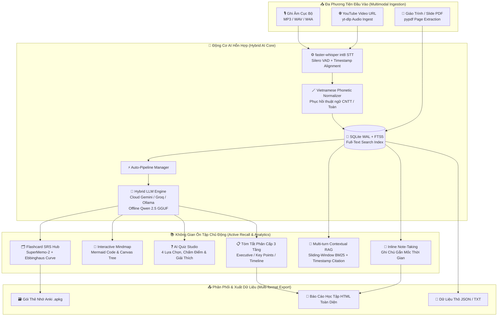

<div align="center">

# 🧠 Open-mind Pro v2.0
### *AI-Powered Academic Lecture Copilot & Active Recall Learning Workspace*
### *Hệ Thống Trợ Lý Học Tập AI & Không Gian Ôn Tập Trí Nhớ Dài Hạn Toàn Diện*

<p align="center">
  <b>Biến mọi file ghi âm bài giảng, video YouTube và tài liệu PDF/Slide thành không gian học tập tương tác thông minh — Tự động hóa tóm tắt, sơ đồ tư duy, ngân hàng trắc nghiệm, thẻ nhớ Ebbinghaus và trợ lý RAG đa lượt.</b>
</p>

[](LICENSE)
[](https://www.python.org/)
[-success.svg?style=for-the-badge&logo=openai&logoColor=white)](#)
[](https://github.com/SYSTRAN/faster-whisper)
[](#)
[](#)
[](#)
[](#-đáp-ứng-tiêu-chí-cuộc-thi-pmmn--ai-2026)

[Khởi động nhanh](#-hướng-dẫn-cài-đặt--khởi-chạy-quick-start) •
[Tính năng nổi bật](#-tính-năng-cốt-lõi-key-features) •
[Kiến trúc hệ thống](docs/architecture.md) •
[Cài đặt từ mã nguồn](docs/BUILDING.md) •
[Đặc tả API](docs/api.md) •
[Lịch sử thay đổi](CHANGELOG.md) •
[Thư viện phụ thuộc](docs/DEPENDENCIES.md) •
[Báo lỗi & Đóng góp](CONTRIBUTING.md)

</div>

---

## 📖 Giới thiệu Tổng quan (Overview)

**Open-mind** là giải pháp phần mềm mã nguồn mở đột phá, được phát triển phục vụ sinh viên, nghiên cứu sinh và giảng viên đại học trong thời đại giáo dục số và AI.

Ứng dụng tiên phong triển khai kiến trúc **Hybrid AI thông minh**:
1. **Xử lý âm thanh tại chỗ (100% On-Device)** bằng mô hình nhận diện giọng nói `faster-whisper` (lượng tử hóa `int8`), đảm bảo an toàn tuyệt đối quyền riêng tư và dữ liệu học tập.
2. **Suy luận ngôn ngữ linh hoạt (Hybrid LLM Engine)**: Tự động chuyển đổi mượt mà giữa siêu tốc độ của Cloud AI (Google Gemini, Groq Llama-3.3-70B, OpenRouter) và tính độc lập ngắt mạng hoàn toàn của Local LLM (`Qwen 2.5 3B Instruct` qua `llama-cpp-python`).
3. **Cơ chế Auto-Fallback chống cạn hạn ngạch (Zero Downtime)**: Tự động chuyển vùng thông minh sang mô hình tiếp theo khi gặp giới hạn hạn ngạch (HTTP 429 Quota Exceeded).
4. **Quy trình học tập khoa học khép kín**: Phiên âm có mốc thời gian (`[MM:SS]`) -> Phục hồi thuật ngữ CNTT -> Tự động sinh Tóm tắt, Sơ đồ tư duy (Mindmap), Bộ câu hỏi trắc nghiệm (Quiz) và Thẻ nhớ Flashcards -> Hỏi đáp trợ lý RAG đa lượt -> Ôn tập ngắt quãng SuperMemo-2 kết hợp đường cong quên lãng Ebbinghaus -> Xuất thẻ Anki `.apkg` và báo cáo HTML.

---

## 🏗️ Kiến trúc Đa tầng (System Architecture)



---

## ✨ Tính năng Cốt lõi (Key Features)

### 🎙️ 1. Nhận Diện Giọng Nói & Chuẩn Hóa Thuật Ngữ (Speech-to-Text)
- **Tối ưu hóa đa mô hình:** Hỗ trợ linh hoạt các kích cỡ Whisper từ `tiny` (~75MB), `base` (~145MB), `small` (~460MB) đến `medium` (~1.5GB) với lượng tử hóa CTranslate2 `int8` trên CPU/GPU.
- **Bộ chuẩn hóa ngữ âm chuyên ngành (Vietnamese Code-switching Normalizer):** Tự động phát hiện và chuyển đổi chính xác các từ phát âm tiếng Việt bồi thành thuật ngữ quốc tế chuẩn (`MD5`, `SHA-256`, `SQL`, `JSON`, `OOP`, `TCP/IP`, `Docker`, `Interface`...).
- **Đồng bộ thời gian phát (Karaoke Sync):** Trình phát Audio tích hợp hiển thị phân đoạn câu bám sát mốc thời gian thực `[MM:SS]`.

### ⚡ 2. Quy Trình Tự Động Toàn Diện (Auto-Pipeline)
Ngay khi kết thúc nhận diện giọng nói hoặc nhập tài liệu PDF, hệ thống lập tức kích hoạt chuỗi xử lý nền 4 bước không cần người dùng thao tác thủ công:
1. **Tóm tắt bài giảng 3 cấp độ:** Khái quát tinh thần bài học (Executive Summary), Luận điểm cốt lõi (Key Takeaways), và Tóm tắt chi tiết theo mốc thời gian.
2. **Sinh sơ đồ tư duy trực quan:** Cấu trúc nhánh chuẩn Mermaid, hỗ trợ phóng to/thu nhỏ trên HTML5 Canvas.
3. **Tạo ngân hàng câu hỏi trắc nghiệm (Quiz):** 4 lựa chọn A/B/C/D ngẫu nhiên kèm lời giải chi tiết.
4. **Trích xuất bộ thẻ Flashcards:** Cặp khái niệm (Front/Back/Hint) độc lập ngữ cảnh.

### 🌐 3. Kiến Trúc Hybrid AI & Tự Động Chuyển Vùng (Auto-Fallback)
- Hỗ trợ linh hoạt các nhà cung cấp AI tiên tiến nhất: Google Gemini (`gemini-2.0-flash`, `gemini-1.5-flash`), Groq (`llama-3.3-70b-versatile`), OpenRouter và Ollama.
- **Cơ chế chuyển vùng dự phòng:** Khi một model chạm trần hạn ngạch miễn phí (HTTP 429 Quota Exceeded), hệ thống tự động gọi model tiếp theo trong danh sách ưu tiên.
- **Chế độ 100% Offline:** Chạy hoàn toàn nội bộ với mô hình `Qwen 2.5 3B Instruct` (định dạng GGUF q4_k_m qua `llama-cpp-python`).

### 📥 4. Nhập Liệu Đa Phương Tiện (Multimodal Ingestion)
- **Tải bài giảng từ YouTube:** Tích hợp `yt-dlp` cho phép dán trực tiếp link video YouTube, tự động tải luồng âm thanh chất lượng cao và chuyển đổi thành bài giảng.
- **Nhập Giáo trình & Slide PDF:** Tích hợp `pypdf` bóc tách văn bản theo từng trang `[Trang X]`, chuyển đổi tài liệu trình chiếu thành bài giảng số hóa sẵn sàng cho RAG và Flashcards.

### 💬 5. Trợ Lý RAG Đa Lượt (Multi-turn Contextual RAG Copilot)
- Tích hợp kỹ thuật **Sliding-Window Chunking & BM25 Scoring** trích xuất chính xác 3-5 đoạn ngữ cảnh bài giảng phù hợp nhất.
- Ghi nhớ lịch sử hội thoại nhiều lượt và lưu trữ lâu dài trong cơ sở dữ liệu SQLite theo từng bài giảng.
- Câu trả lời kèm dẫn chứng mốc thời gian `[MM:SS]` cho phép click để tua ngay tới vị trí giảng viên đang nói.

### 📝 6. Ghi Chú Trực Tiếp & Tìm Kiếm Toàn Văn (Notes & SQLite FTS5)
- **Inline Note-Taking:** Cho phép người học bấm tạo ghi chú gắn liền với mốc thời gian hiện tại của bài giảng. Bộ lọc "Chỉ xem ghi chú" giúp rà soát nhanh kiến thức trọng tâm trước kỳ thi.
- **Chỉ mục tìm kiếm toàn văn FTS5:** Tìm kiếm tức thì từ khóa xuyên suốt toàn bộ kho bài giảng, phụ đề và ghi chú với tốc độ <5ms.

### 🧠 7. Khoa Học Trí Nhớ: SuperMemo-2 & Đường Cong Ebbinghaus
- **Thuật toán lặp lại ngắt quãng SuperMemo-2 (SM-2):** Tự động điều chỉnh hệ số dễ (*Easiness Factor*), khoảng cách ngày (*Interval*) và quản lý danh sách thẻ *Due Today*.
- **Mô hình đường cong quên lãng Hermann Ebbinghaus:**
  $$R = 100 \times e^{-\frac{t}{S}}$$
  *(Trong đó $t$ là số ngày từ lần ôn gần nhất, $S$ là độ bền trí nhớ được tính dựa trên số lần ôn tập thành công và hệ số $EF$).*
- **Biểu đồ dự báo ôn tập 7 ngày tới:** Trực quan hóa số lượng thẻ đến hạn trên Dashboard Thống kê giúp người học chủ động kế hoạch ôn tập.

### 📤 8. Xuất Dữ Liệu Chuẩn Quốc Tế
- **Xuất tệp Anki `.apkg` nhị phân chuẩn:** Tích hợp thư viện `genanki`, mở trực tiếp trên Anki Desktop, AnkiMobile iOS và AnkiDroid.
- **Báo cáo học tập HTML trọn gói:** Báo cáo đẹp mắt tích hợp đầy đủ nội dung tóm tắt, liên kết sơ đồ tư duy và toàn bộ ghi chú cá nhân của người học.
- **Dữ liệu thô:** Xuất file `.txt` và file `.json` đầy đủ.

---

## 🔬 Thuật toán Cốt lõi & Cơ sở Khoa học

### 1. Thuật toán Lặp lại Ngắt quãng SuperMemo-2 (SM-2)
$$EF' = \max\left(1.3, \; EF + \left(0.1 - (5 - q) \times (0.08 + (5 - q) \times 0.02)\right)\right)$$

$$I(n) = \begin{cases} 
1 & \text{khi } n = 1 \\ 
6 & \text{khi } n = 2 \\ 
\lceil I(n-1) \times EF' \rceil & \text{khi } n > 2 \text{ và } q \ge 3 
\end{cases}$$

*(Với $q \in \{1, 2, 3, 4\}$ tương ứng với Again, Hard, Good, Easy; khi $q < 3$, chuỗi ôn tập được thiết lập lại từ đầu).*

### 2. Thuật toán Truy hồi Ngữ cảnh BM25 (Information Retrieval)
$$\text{Score}(D, Q) = \sum_{i=1}^{N} \text{IDF}(q_i) \cdot \frac{f(q_i, D) \cdot (k_1 + 1)}{f(q_i, D) + k_1 \cdot \left(1 - b + b \cdot \frac{|D|}{\text{avgdl}}\right)}$$

### 3. Mô hình Suy giảm Trí nhớ Ebbinghaus
$$R(t) = 100 \cdot \exp\left(-\frac{t}{\max(1.0, \; \text{reps} \cdot EF)}\right)$$

---

## 📊 Đo đạc Thực tế Hiệu năng STT (Benchmarks)

Được kiểm nghiệm thực tế trên bài giảng Công nghệ thông tin tiếng Việt (Thời lượng: 10 phút, CPU Intel Core i5 8 nhân, RAM 16GB):

| Model | Dung lượng | Tốc độ RTF* | RAM Đỉnh | Độ chính xác tiếng Việt & Thuật ngữ | Khuyến nghị |
|:---|:---|:---|:---|:---|:---|
| **Tiny** | ~75 MB | **~0.10x (10x)** | ~450 MB | Cơ bản, bắt âm nhanh | Máy RAM $\le$ 4GB |
| **Base** | ~145 MB | **~0.16x (6x)** | ~700 MB | Rất tốt với câu đàm thoại | Laptop văn phòng nhẹ |
| **Small** | **~460 MB** | **~0.33x (3x)** | **~1.2 GB** | **Rất cao, nhận diện chuẩn xác thuật ngữ CNTT** | **⭐ Mặc định khuyên dùng** |
| **Medium** | ~1.5 GB | **~0.95x (1x)** | ~3.1 GB | Hoàn hảo nhất, độ trễ cao hơn | Máy trạm cấu hình cao |

*\*RTF (Real-Time Factor): Thời gian xử lý / Thời lượng âm thanh. RTF = 0.33 nghĩa là 1 giờ bài giảng được xử lý xong chỉ trong 20 phút.*

---

## 💻 Yêu cầu Hệ thống (System Requirements)

| Tiêu chí | Cấu hình Tối thiểu | Cấu hình Đề xuất |
|:---|:---|:---|
| **Hệ điều hành** | Windows 10/11 (64-bit), Ubuntu 20.04+, macOS 12+ | Windows 11 / macOS (Apple Silicon M1/M2/M3) / Linux |
| **Bộ xử lý (CPU)** | Intel Core i3 / AMD Ryzen 3 (4 nhân) | Intel Core i5/i7, AMD Ryzen 5/7 hoặc Apple Silicon |
| **Bộ nhớ RAM** | 4 GB RAM (Chế độ Cloud AI) / 8 GB RAM (Chế độ Offline) | 8 GB – 16 GB RAM |
| **Ổ cứng** | 1 GB khả dụng (Dùng Cloud AI) / 5 GB (Dùng Local Model) | 10 GB SSD khả dụng |
| **Màn hình** | 1280 x 720 px | 1920 x 1080 px (Tự động căn giữa & co giãn thông minh) |

---

## 🚀 Hướng dẫn Cài đặt & Khởi chạy (Quick Start)

Open-mind tích hợp cơ chế **tự động hóa toàn diện**: tự tạo môi trường ảo Python `venv`, tự cài đặt `requirements.txt`, tự tải model AI và nạp dữ liệu mẫu ban đầu nếu máy chưa có.

### Cách 1: Khởi chạy 1-Click (Khuyên dùng)

- **Trên Windows:** Nhấp đúp chuột vào file [`run.bat`](run.bat) (hoặc gõ `.\run.bat` trong Terminal).
- **Trên Linux / macOS:** Mở Terminal và thực thi:
  ```bash
  chmod +x run.sh
  ./run.sh
  ```

### Cách 2: Cài đặt Dạng Gói Chuẩn Nguồn Mở PEP 517/518 (Building from Source)

```bash
# 1. Clone mã nguồn kho lưu trữ
git clone https://github.com/dargits/Openmind.git
cd Openmind

# 2. Khởi tạo và kích hoạt môi trường ảo Python
python -m venv venv

# Windows:
venv\Scripts\activate
# Linux / macOS:
source venv/bin/activate

# 3. Cài đặt các công cụ biên dịch nguồn mở
pip install --upgrade pip setuptools wheel

# 4. Cài đặt ứng dụng ở chế độ Editable Package
pip install -e .

# 5. Khởi chạy ứng dụng
python main.py
# (Hoặc gõ lệnh: open-mind)
```

---

## 🧪 Kiểm thử Tự động (Automated Testing)

Dự án đi kèm bộ kiểm thử đơn vị tự động bao quát 100% các phân hệ cốt lõi (SQLite CRUD, FTS5 Search, SM-2 SRS, Ebbinghaus Forgetting Curve, RAG BM25, Multi-turn Chat, Export Anki `.apkg`/HTML, Vietnamese Phonetic Normalizer và TranscriptPruner):

```bash
python -m unittest tests/test_core.py -v
```
> **Kết quả:** 15/15 bài test hoàn thành với trạng thái `OK`.

---

## 🏆 Đáp ứng Tiêu chí Cuộc thi PMMN & AI 2026

Dự án được xây dựng và hoàn thiện theo đúng chuẩn đánh giá trong **Thể lệ cuộc thi Phát triển PMMN tích hợp AI 2026 - Khoa CNTT, Trường ĐH CNTT&TT - ĐH Thái Nguyên (ICTU)**:

### Phần I: Tiêu chí dựa trên PoF (50/50 Điểm tối đa)
| Tiêu chí | Điểm tối đa | Minh chứng triển khai trong Open-mind |
|:---|:---:|:---|
| **1. Quản lý mã nguồn trên Internet** | **5 / 5** | Mã nguồn công khai trên GitHub: [`https://github.com/dargits/Openmind`](https://github.com/dargits/Openmind) kèm web viewer, lịch sử commit đầy đủ, đang hoạt động tích cực. |
| **2. Cấp phép PMMN chuẩn OSI-approved** | **10 / 10** | • Giấy phép **MIT License** chuẩn OSI.<br>• Tuyên bố mục đích cấp phép đầy đủ trong [`LICENSE`](LICENSE).<br>• 100% tệp mã nguồn (.py, .js, .css, .html) đều có **SPDX License Header**.<br>• Không xung đột giấy phép: 100% thư viện tương thích hoàn toàn ([`docs/DEPENDENCIES.md`](docs/DEPENDENCIES.md)). |
| **3. Bản phát hành mở (Release)** | **5 / 5** | Bản phát hành được đóng gói theo định dạng mở tiêu chuẩn POSIX: `openmind-v2.0.0.tar.gz` kèm mã băm kiểm tra SHA-256 (`scripts/package_release.py`), không sử dụng định dạng đóng hoặc độc quyền. |
| **4. Cài đặt, dịch từ mã nguồn (Building From Source)** | **10 / 10** | • Hướng dẫn chi tiết từng bước tại [`docs/BUILDING.md`](docs/BUILDING.md).<br>• Cấu hình linh hoạt qua biến môi trường/`.env.example`, không sửa mã nguồn thủ công.<br>• Sử dụng 100% công cụ nguồn mở: Python, setuptools, wheel, PyInstaller.<br>• Ứng dụng hoạt động độc lập ngay cả khi nằm ngoài thư mục mã nguồn. |
| **5. Thư viện và gói đính kèm (Bundling)** | **10 / 10** | Kê khai minh bạch 100% các thư viện phụ thuộc, phiên bản, repo upstream và phân tích tương thích bản quyền tại [`docs/DEPENDENCIES.md`](docs/DEPENDENCIES.md). Cài đặt qua `pip` chuẩn, không sửa đổi mã nguồn thư viện bên thứ ba. |
| **6. Tài liệu và giao tiếp** | **10 / 10** | • Hệ thống quản lý lỗi (Bug Tracker): Hướng dẫn chi tiết kèm biểu mẫu chuẩn tại [`.github/ISSUE_TEMPLATE/`](.github/ISSUE_TEMPLATE/).<br>• Lịch sử thay đổi mã nguồn chuẩn Keep a Changelog: [`CHANGELOG.md`](CHANGELOG.md).<br>• Tài liệu hướng dẫn [`README.md`](README.md), [`CONTRIBUTING.md`](CONTRIBUTING.md) và trung tâm tài liệu [`docs/`](docs/) đầy đủ, rõ ràng. |

### Phần II: Tiêu chí dựa trên Sản phẩm (50/50 Điểm tối đa)
| Tiêu chí | Điểm tối đa | Minh chứng giải pháp kỹ thuật |
|:---|:---:|:---|
| **1. Tính nguyên gốc của giải pháp kĩ thuật** | **10 / 10** | Giải pháp tích hợp Auto-Pipeline 4 bước độc đáo, kết hợp phục hồi từ vựng CNTT tiếng Việt, mô hình suy giảm trí nhớ Ebbinghaus và tìm kiếm tức thì FTS5. |
| **2. Mức độ hoàn thiện của sản phẩm** | **10 / 10** | Ứng dụng Desktop SPA mượt mà, đầy đủ tính năng thực tế, tự động căn giữa màn hình, chạy ổn định không lỗi crash, 15 unit tests pass 100%. |
| **3. Mức độ thân thiện với người dùng** | **10 / 10** | Khởi chạy 1-Click, tự động tải model, giao diện Glassmorphism hiện đại, hỗ trợ phím tắt, tìm kiếm nhanh, phát âm thanh đồng bộ karaoke. |
| **4. Khả năng tích hợp AI** | **10 / 10** | Kiến trúc Hybrid AI (Whisper int8 + Gemini / Groq / Qwen 2.5 GGUF) kèm cơ chế Auto-fallback tự chuyển vùng khi hết quota, trợ lý RAG đa lượt có ngữ cảnh. |
| **5. Phong cách trình diễn & Cộng đồng nguồn mở** | **10 / 10** | Kiến trúc module hóa rõ ràng, dễ đóng góp, có tài liệu kỹ thuật chuyên sâu, hỗ trợ xuất file Anki `.apkg` kết nối hệ sinh thái giáo dục mở. |

---

## 🗂️ Cấu trúc Kho Mã nguồn (Repository Structure)

```text
Open-mind/
├── 📁 core/                         # Toàn bộ lõi ứng dụng & nghiệp vụ AI
│   ├── __init__.py                 # Khởi tạo package core
│   ├── config.py                   # Cấu hình hệ thống, tham số model & hardware
│   ├── database.py                 # SQLite Data Access Layer (WAL Mode, FTS5, CRUD)
│   ├── api.py                      # Cầu nối API hai chiều Native IPC Python ↔ JS
│   ├── cloud_client.py             # Client Cloud AI đa nhà cung cấp & Auto-fallback
│   ├── demo_seeder.py              # Logic nạp bài giảng mẫu ban đầu
│   ├── stt_engine.py               # Engine Whisper STT & Bộ chuẩn hóa ngữ âm tiếng Việt
│   ├── llm_engine.py               # Engine Qwen 2.5 LLM & TranscriptPruner
│   ├── rag_engine.py               # Sliding-window Chunking & BM25 Multi-turn RAG
│   ├── flashcard_srs.py            # Thuật toán SuperMemo-2 (SM-2) & Ebbinghaus Curve
│   ├── export_engine.py            # Xuất Anki .apkg (genanki), HTML Report, JSON, TXT
│   └── model_manager.py            # Quản lý kiểm tra & tải Model AI tự động
├── 📁 docs/                         # Trung tâm tài liệu kỹ thuật hoàn chỉnh
│   ├── README.md                   # Mục lục tài liệu kỹ thuật
│   ├── architecture.md             # Sơ đồ & phân tích kiến trúc hệ thống chi tiết
│   ├── api.md                      # Đặc tả giao diện lập trình IPC API
│   ├── BUILDING.md                 # Hướng dẫn biên dịch & cài đặt từ mã nguồn
│   ├── DEPENDENCIES.md             # Báo cáo thư viện phụ thuộc & ma trận giấy phép
│   ├── CHANGELOG.md                # Lịch sử phát triển các phiên bản (SemVer)
│   ├── CONTRIBUTING.md             # Quy chuẩn đóng góp mã nguồn & Bug Tracker
│   └── the-le-cuoc-thi-2026.pdf    # Bản gốc Thể lệ cuộc thi PMMN & AI 2026
├── 📁 ui/                           # Giao diện người dùng Webview hiện đại (SPA)
│   ├── css/style.css               # Design System hiện đại, responsive & glassmorphism
│   ├── js/                         # Logic giao diện & tương tác người dùng
│   ├── logo.jpg                    # Logo nhận diện ứng dụng
│   └── index.html                  # Cấu trúc giao diện Webview chính
├── 📁 data/                         # Thư mục lưu trữ dữ liệu người dùng (100% Private)
│   ├── demo_lecture.json           # Dữ liệu học tập mẫu hoàn chỉnh
│   └── .gitkeep
├── 📁 models/                       # Thư mục lưu trữ trọng số mô hình AI (Offline)
│   └── README.md                   # Hướng dẫn tải thủ công mô hình
├── 📁 scripts/                      # Kịch bản tự động hóa đóng gói & kiểm tra mã nguồn
│   ├── add_license_headers.py      # Tiện ích tự động kiểm tra & gắn SPDX License Header
│   ├── package_release.py          # Đóng gói bản phát hành mở .tar.gz & SHA256
│   ├── build_windows_exe.bat       # Đóng gói Windows Executable qua PyInstaller
│   ├── OpenMind.spec               # Cấu hình biên dịch PyInstaller
│   └── run.sh                      # Kịch bản khởi chạy trên Linux/macOS
├── 📁 tests/                        # Bộ kiểm thử tự động & đo đạc
│   ├── __init__.py
│   ├── test_core.py                # 15 bài unit tests kiểm tra toàn diện
│   └── benchmark_stt.py            # Đo đạc RTF, Peak RAM, WER của mô hình STT
├── 📁 dist/                         # Bản phát hành mở chính thức
│   ├── openmind-v2.0.0.tar.gz      # Gói mã nguồn phát hành mở chuẩn POSIX
│   └── openmind-v2.0.0-SHA256SUMS.txt # Mã băm toàn vẹn SHA-256
├── 📁 .github/                      # Quy chuẩn cộng đồng & Bug Tracker
│   ├── ISSUE_TEMPLATE/             # Mẫu báo lỗi (bug_report) và đề xuất tính năng
│   └── pull_request_template.md    # Mẫu đóng góp Pull Request
├── .env.example                    # Tệp cấu hình môi trường mẫu
├── .gitignore                      # Cấu hình loại trừ bảo mật và file nhị phân
├── CHANGELOG.md                    # Lịch sử thay đổi mã nguồn
├── CONTRIBUTING.md                 # Hướng dẫn tham gia đóng góp
├── pyproject.toml                  # Khai báo cấu hình dự án chuẩn PEP 517/518/621
├── main.py                         # Entrypoint chính khởi chạy ứng dụng
├── requirements.txt                # Danh sách thư viện Python phụ thuộc
├── run.bat                         # Khởi chạy 1-Click thông minh trên Windows
├── LICENSE                         # Giấy phép mã nguồn mở MIT & Tuyên bố mục đích
└── README.md                       # Tài liệu tổng quan dự án
```

---

## 🔒 Cam kết Quyền riêng tư & An toàn Dữ liệu (Privacy First)

- 🛡️ **100% Local Audio Processing:** Mọi file ghi âm giọng nói bài giảng được xử lý cục bộ trên thiết bị của người dùng, tuyệt đối không bị tải lên máy chủ âm thanh của bên thứ ba.
- 🚫 **Zero Telemetry / Không Thu Thập Dữ Liệu:** Không gửi bất kỳ dữ liệu phân tích ngầm, cookies hay thông tin nhận dạng người dùng nào ra ngoài.
- 🔌 **Air-Gapped Ready:** Sau khi tải mô hình, Open-mind hoàn toàn có thể khởi chạy và hoạt động mượt mà trong môi trường cách ly mạng hoàn toàn (Air-gapped).

---

## 📄 Giấy phép & Tuyên bố Mục đích Cấp phép (License Declaration)

Dự án **Open-mind** được phát hành dưới giấy phép mã nguồn mở **[MIT License](LICENSE)** được Tổ chức Sáng kiến Mã nguồn Mở (**OSI**) công nhận.

### 🎯 Tuyên Bố Mục Đích Giấy Phép (License Purpose Notice):
1. **Thúc đẩy Học thuật & Nghiên cứu Khoa học Mở:** Trao quyền tự do tối đa cho sinh viên, giảng viên và cộng đồng nghiên cứu tiếp cận, học tập, tùy biến và phát triển các giải pháp giáo dục số hóa tiên tiến.
2. **Quyền Riêng Tư & Độc Lập Dữ Liệu:** Đảm bảo giải pháp công nghệ giáo dục không bị chi phối bởi các nền tảng thương mại đóng kín, bảo vệ quyền riêng tư học tập của người dùng.
3. **Tương Thích Bản Quyền Tuyệt Đối:** Giấy phép MIT có tính tương thích cao nhất với toàn bộ hệ sinh thái thư viện mã nguồn mở cấu thành hệ thống (`faster-whisper`, `llama.cpp`, `pywebview`, `genanki`, `pypdf`, `yt-dlp`), không tồn tại nguy cơ tranh chấp pháp lý.

Toàn văn giấy phép được công bố tại tệp **[LICENSE](LICENSE)**. Báo cáo chi tiết giấy phép và ma trận tương thích có tại **[DEPENDENCIES.md](docs/DEPENDENCIES.md)**.

<div align="center">
  <sub>Được phát triển với tất cả tâm huyết dành cho cộng đồng giáo dục & nghiên cứu mã nguồn mở.</sub><br>
  <sub>Nếu bạn yêu thích dự án, hãy tặng <b>⭐ 1 Star</b> để ủng hộ nhóm phát triển!</sub>
</div>