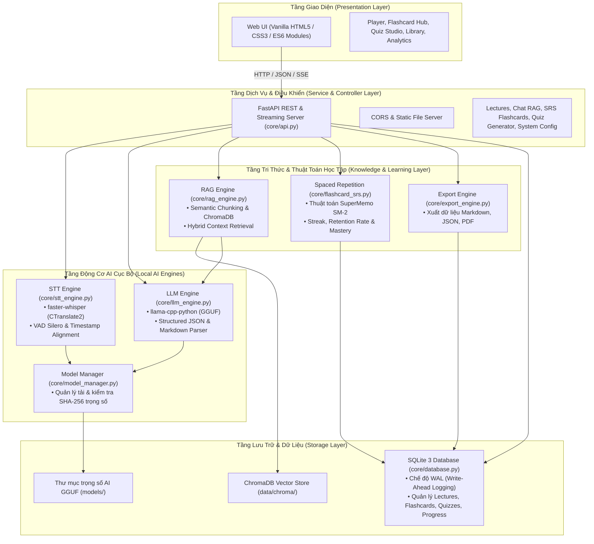
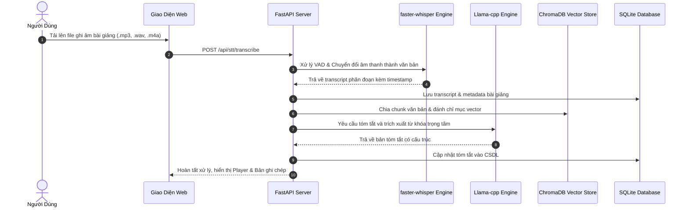
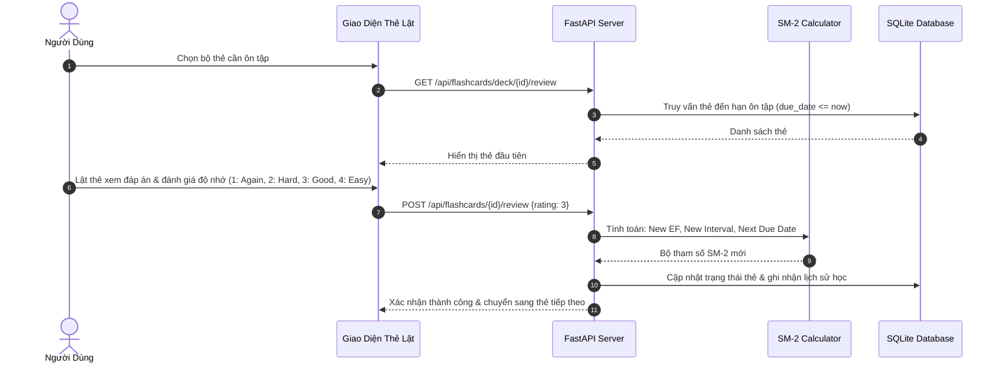

# Kiến Trúc Hệ Thống OpenMind (System Architecture)

Tài liệu này mô tả chi tiết kiến trúc kỹ thuật của hệ thống **OpenMind** — Trợ lý học tập thông minh ngoại tuyến (Offline AI Learning Assistant).

---

## 1. Sơ Đồ Kiến Trúc Tổng Quan (High-Level Architecture)

OpenMind được thiết kế theo mô hình kiến trúc phân tầng (Layered Architecture) module hóa cao, đảm bảo khả năng hoạt động 100% độc lập không cần kết nối Internet, bảo mật dữ liệu tuyệt đối và tối ưu hóa hiệu năng trên phần cứng dân dụng phổ thông.

---

## 2. Chi Tiết Các Phân Hệ Chính

### 2.1. Tầng Giao Diện Người Dùng (Presentation Layer)
- **Công nghệ**: HTML5 ngữ nghĩa, CSS3 hiện đại (CSS Variables, Flexbox/Grid, Dark/Light Mode, Glassmorphism), JavaScript ES6 Modules.
- **Biểu tượng**: Bộ thư viện vector nhẹ Lucide Icons tích hợp cục bộ (`ui/js/lucide.min.js`).
- **Phân hệ chức năng**:
  - `lecture.js`: Giao diện xử lý bài giảng, tải âm thanh/video, đồng bộ thời gian phát (karaoke playback sync), tóm tắt và ghi chú.
  - `flashcard.js`: Bộ luyện tập flashcard tương tác 3D lật thẻ, chấm điểm độ khó (Again, Hard, Good, Easy) cập nhật trực tiếp vào thuật toán SM-2.
  - `library.js`: Quản lý kho tài liệu, bài giảng cá nhân, tìm kiếm và lọc nội dung.
  - `stats.js`: Biểu đồ thống kê thời gian học, chuỗi ngày liên tục (streak), tỷ lệ ghi nhớ và độ thuần thục bài học.
  - `settings.js`: Bảng điều khiển cấu hình hệ thống, số luồng CPU, kích thước mô hình Whisper và Llama.

### 2.2. Tầng Dịch Vụ API & Bộ Điều Khiển (API & Controller Layer)
- **FastAPI Framework**: Cung cấp các RESTful endpoints bất đồng bộ (Asynchronous) với hiệu năng cao.
- **Streaming Response**: Hỗ trợ Server-Sent Events (SSE) cho phép xuất luồng văn bản (token streaming) khi trò chuyện với mô hình AI hoặc tiến độ chuyển đổi âm thanh.
- **Tương thích đa nền tảng**: Tự động phục vụ các tệp giao diện tĩnh, đồng thời cho phép tích hợp linh hoạt với các ứng dụng máy trạm (Desktop Wrapper như PyWebView hoặc Electron).

### 2.3. Tầng Động Cơ AI Cục Bộ (Local AI Engines)
1. **Speech-to-Text (STT Engine)**:
   - Dựa trên công nghệ `faster-whisper` tối ưu hóa bằng CTranslate2.
   - Tích hợp bộ lọc âm giọng nói Silero VAD (Voice Activity Detection) để loại bỏ các đoạn im lặng, giảm thiểu độ trễ tới 400% so với Whisper gốc.
   - Trích xuất văn bản kèm timestamp chuẩn xác từng từ/câu và chuẩn hóa thuật ngữ kỹ thuật (`core/stt_engine.py`).
2. **Large Language Model (LLM Engine)**:
   - Sử dụng `llama-cpp-python` để suy luận trực tiếp các mô hình ngôn ngữ lớn định dạng nén lượng tử hóa 4-bit (GGUF: Qwen 2.5, Llama 3, PhoGPT, v.v.).
   - Bộ sinh câu hỏi trắc nghiệm (Quiz Generator) và thẻ ghi nhớ (Flashcard Generator) với cơ chế tự động sửa lỗi cấu trúc JSON và chia nhỏ batch để đảm bảo sinh đủ số lượng yêu cầu với chất lượng nội dung cao.

### 2.4. Tầng RAG & Thuật Toán Học Tập (RAG & Learning Layer)
1. **RAG Pipeline (Retrieval-Augmented Generation)**:
   - Tự động chia nhỏ bài giảng thành các đoạn ngữ nghĩa (semantic chunks) với độ chồng lấn (overlap) phù hợp.
   - Đánh chỉ mục vector cục bộ vào ChromaDB.
   - Cho phép người dùng trò chuyện, hỏi đáp dựa trên đúng nội dung bài giảng mà không bị hiện tượng ảo giác (hallucination).
2. **Thuật toán lặp lại ngắt quãng SuperMemo SM-2**:
   - Tính toán khoảng thời gian lặp lại (Interval), số lần ôn tập (Repetitions) và hệ số dễ (Easiness Factor - EF) dựa trên đánh giá thực tế của người học.
   - Đảm bảo kiến thức được củng cố ngay trước thời điểm người học có nguy cơ quên theo đường cong lãng quên Ebbinghaus.

### 2.5. Tầng Lưu Trữ (Storage Layer)
- **SQLite3 với WAL Mode**: Lưu trữ toàn bộ dữ liệu người dùng (bài giảng, transcripts, danh sách thẻ, tiến trình trả lời quiz) với tính toàn vẹn cao, hỗ trợ đọc/ghi đồng thời không khóa bảng.
- **Biến môi trường động**: Quản lý đường dẫn lưu trữ thông qua các biến cấu hình (`OPENMIND_DATA_DIR`, `OPENMIND_MODELS_DIR`), dễ dàng sao lưu hoặc di chuyển dữ liệu.

---

## 3. Luồng Dữ Liệu Tiêu Biểu (End-to-End Data Flows)

### 3.1. Luồng Xử Lý Bài Giảng Từ File Âm Thanh

### 3.2. Luồng Ôn Tập Thẻ Ghi Nhớ Với Thuật Toán SM-2

