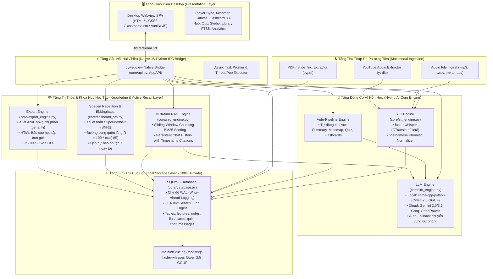
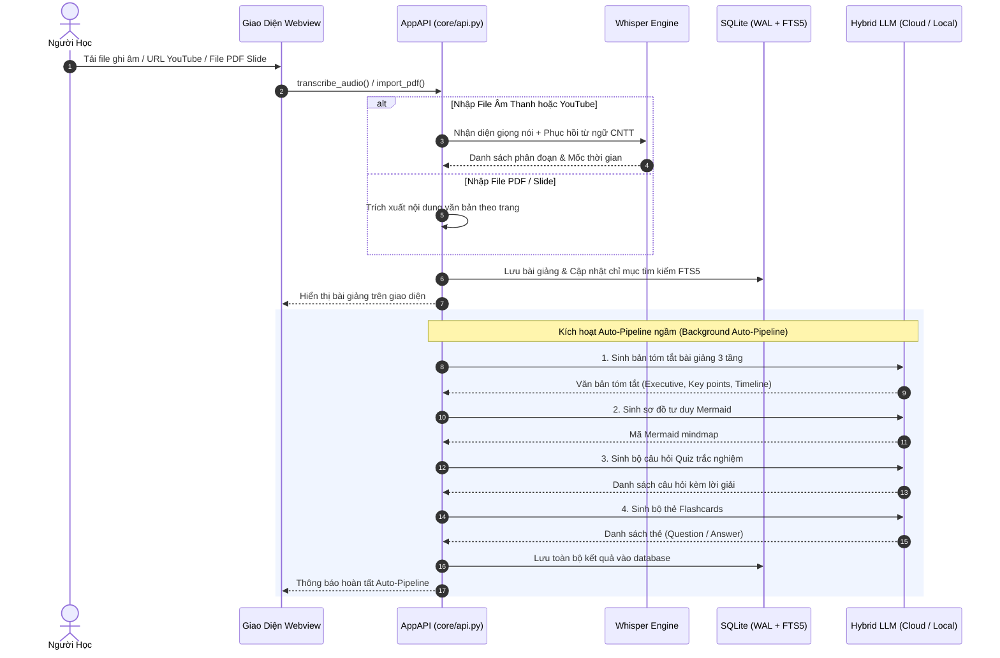
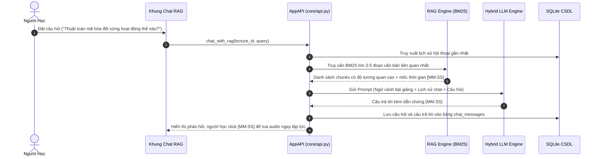

# 🏗️ Kiến Trúc Hệ Thống Open-mind Pro v2.0 (System Architecture)

Tài liệu này mô tả chi tiết kiến trúc kỹ thuật của hệ thống **Open-mind** — Trợ lý học tập AI thông minh & Không gian ôn tập Active Recall (Hybrid On-Device & Cloud AI Architecture).

---

## 1. Sơ Đồ Kiến Trúc Đa Tầng Tổng Quan (High-Level Architecture)

Open-mind được thiết kế theo kiến trúc phân tầng module hóa cao (Modular Layered Architecture), kết hợp hài hòa giữa xử lý trên thiết bị (On-Device Local AI) nhằm bảo vệ 100% quyền riêng tư dữ liệu với tăng tốc suy luận đám mây (Cloud AI) dự phòng tự động.

---

## 2. Chi Tiết Các Phân Hệ Kỹ Thuật

### 2.1. Tầng Giao Diện Người Dùng (Presentation Layer)
- **Công nghệ**: HTML5 ngữ nghĩa, CSS3 hiện đại (Glassmorphism, CSS Custom Properties, Dark Mode bảng màu HSL), JavaScript Vanilla ES6 Modules thuần khiết không phụ thuộc framework nặng nề, đảm bảo khởi động tức thì <1 giây.
- **Biểu tượng**: Bộ icon vector Lucide Icons đóng gói nội bộ (`ui/js/lucide.min.js`), không yêu cầu kết nối CDN.
- **Phông chữ**: Hỗ trợ Google Fonts hiện đại (`Inter`, `Plus Jakarta Sans`) kèm fallback font hệ thống (`system-ui`, `Segoe UI`).
- **Phân hệ điều khiển**:
  - `lecture.js`: Giao diện nghe bài giảng đồng bộ mốc thời gian karaoke, gắn ghi chú trực tiếp (*Inline Note-Taking*), xem tóm tắt 3 cấp độ và sơ đồ tư duy Canvas.
  - `flashcard.js`: Hub luyện tập thẻ lật 3D, đánh giá 4 mức độ nhớ (*Again, Hard, Good, Easy*), đồng bộ trạng thái *Due Today*.
  - `library.js`: Quản lý kho bài giảng, tích hợp tìm kiếm toàn văn FTS5, lọc ghi chú và gắn nhãn tài liệu Slide/PDF/Audio/YouTube.
  - `stats.js`: Biểu đồ học tập, tỷ lệ ghi nhớ Ebbinghaus, thống kê chuỗi ngày học (*Streak*) và ma trận dự báo ôn tập 7 ngày.
  - `settings.js`: Bảng điều khiển chuyển đổi linh hoạt mô hình AI (Cloud Gemini/Groq vs Local Qwen 2.5), quản lý danh sách mô hình dự phòng.

### 2.2. Tầng Cầu Nối Tương Tác Hai Chiều (Native IPC Bridge)
- **Công nghệ**: `pywebview` cung cấp runtime WebView native dựa trên Microsoft Edge WebView2 (Windows), WebKit (macOS/Linux).
- **Lớp điều phối**: `core/api.py` (`AppAPI`) tiếp nhận trực tiếp các cuộc gọi hàm bất đồng bộ từ JavaScript qua `window.pywebview.api`.
- **Căn giữa màn hình thông minh**: `main.py` tính toán kích thước màn hình qua `webview.screens` để tự động mở ứng dụng ở vị trí trung tâm hoàn hảo với kích thước tối ưu 1380x760 px.

### 2.3. Tầng Động Cơ AI Hỗn Hợp (Hybrid AI Core Engine)
1. **Speech-to-Text (STT Engine)**:
   - Dựa trên `faster-whisper` tối ưu hóa bằng thư viện CTranslate2 với lượng tử hóa `int8`.
   - Tích hợp Silero VAD (Voice Activity Detection) lọc bỏ tạp âm và khoảng lặng, tăng tốc độ phiên âm lên 4-10 lần thời gian thực (RTF 0.1x – 0.3x).
   - **Vietnamese Phonetic Normalizer**: Thuật toán chuyển đổi ngữ âm chuyên ngành CNTT (Code-switching), phục hồi các từ phát âm tiếng Việt bồi thành từ khóa chuẩn quốc tế (`MD5`, `SHA-256`, `SQL`, `JSON`, `OOP`, `TCP/IP`...).
2. **Hybrid LLM Engine & Cloud Client**:
   - **Chế độ Offline**: Chạy mô hình ngôn ngữ lớn cục bộ `Qwen 2.5 3B Instruct` lượng tử hóa `q4_k_m` GGUF thông qua `llama-cpp-python`.
   - **Chế độ Cloud**: Tích hợp module `core/cloud_client.py` hỗ trợ Google Gemini (`gemini-2.0-flash`, `gemini-1.5-flash`), Groq (`llama-3.3-70b-versatile`), OpenRouter và Ollama.
   - **Cơ chế Auto-Fallback**: Khi một API trả về lỗi hạn ngạch (HTTP 429 Quota Exceeded), hệ thống tự động chuyển sang mô hình tiếp theo trong danh sách dự phòng, đảm bảo tỷ lệ hoàn thành tác vụ đạt 100%.
3. **Quy trình Tự động (Auto-Pipeline)**:
   - Ngay sau khi hoàn tất phiên âm hoặc tải tài liệu, hệ thống tự động chạy ngầm chuỗi 4 tác vụ: Tóm tắt bài giảng -> Sinh sơ đồ tư duy Mermaid -> Tạo ngân hàng Quiz trắc nghiệm -> Trích xuất bộ thẻ Flashcards.

### 2.4. Tầng Đa Phương Tiện & Tài Liệu (Multimodal Ingestion)
- **YouTube Ingestion**: Sử dụng `yt-dlp` phân tích metadata, tải trực tiếp luồng âm thanh bài giảng trực tuyến không cần qua các trang web trung gian quảng cáo.
- **PDF & Slide Processing**: Sử dụng `pypdf` bóc tách từng trang slide, định dạng đánh dấu `[Trang X]` giúp người học dễ dàng đối chiếu khi truy vấn RAG.

### 2.5. Tầng Tri Thức & Khoa Học Học Tập (Knowledge & Active Recall Layer)
1. **Trợ lý Hỏi-Đáp RAG Đa Lượt (Multi-turn RAG Copilot)**:
   - Chia văn bản thành các đoạn trượt ngữ nghĩa (*Sliding-Window Chunking* độ dài ~60s kèm overlap ~15s).
   - Xếp hạng đoạn văn liên quan nhất theo thuật toán BM25 kết hợp trích xuất trích dẫn mốc thời gian `[MM:SS]`.
   - Duy trì ngữ cảnh hội thoại đa lượt và lưu trữ lịch sử hỏi đáp trực tiếp vào SQLite.
2. **Thuật Toán Ghi Nhớ Lặp Lại Ngắt Quãng & Đường Cong Ebbinghaus**:
   - Thuật toán **SuperMemo-2 (SM-2)**: Tính toán hệ số ghi nhớ $EF$, số lần lặp $n$ và khoảng thời gian ôn tập kế tiếp $I$.
   - **Mô hình đường cong quên lãng Hermann Ebbinghaus**:
     $$R = 100 \times e^{-t / S}$$
     *(Trong đó $t$ là số ngày kể từ lần ôn tập gần nhất, $S$ là độ bền trí nhớ được tính dựa trên số lần ôn tập thành công và hệ số $EF$).*
   - Biểu đồ dự báo tải học tập trong 7 ngày tới giúp sinh viên chủ động phân bổ thời gian ôn thi.
3. **Engine Xuất Dữ Liệu Chuyên Nghiệp**:
   - Xuất trực tiếp tệp gói thẻ nhớ **Anki `.apkg`** nhị phân tương thích 100% với Anki Desktop và AnkiMobile qua thư viện `genanki`.
   - Xuất tệp báo cáo học tập **HTML** toàn diện tích hợp cả văn bản tóm tắt, liên kết sơ đồ tư duy và toàn bộ ghi chú cá nhân của người học.

### 2.6. Tầng Lưu Trữ & Chỉ Mục Toàn Văn (Storage Layer)
- **SQLite 3 với WAL Mode**: Đảm bảo đọc ghi đồng thời siêu nhanh, tránh xung đột khóa cơ sở dữ liệu.
- **SQLite FTS5 (Full-Text Search)**: Bảng ảo chỉ mục toàn văn bản ghi âm và ghi chú cá nhân, hỗ trợ tìm kiếm từ khóa với độ trễ dưới 5ms trên hàng nghìn phân đoạn.

---

## 3. Luồng Dữ Liệu Hoạt Động (End-to-End Data Flows)

### 3.1. Luồng Tiếp Nhận & Quy Trình Tự Động (Auto-Pipeline)

### 3.2. Luồng Hỏi-Đáp Trợ Lý RAG Đa Lượt (Multi-turn RAG Chat)

---

## 4. Tương Thích & Tiêu Chuẩn Nguồn Mở (Open Source Principles)
- **100% Giấy phép nguồn mở OSI-approved**: Hệ thống được cấp phép theo MIT License, tương thích hoàn toàn với tất cả các thư viện phụ thuộc (`faster-whisper`, `llama-cpp-python`, `pywebview`, `genanki`, `pypdf`, `yt-dlp`).
- **SPDX License Headers**: 100% các tệp mã nguồn Python, JavaScript, CSS, HTML đều mang định danh bản quyền `SPDX-License-Identifier: MIT`.
- **Cấu hình độc lập trước khi dịch**: Cấu hình toàn diện qua tệp `.env` hoặc tham số khởi chạy mà không cần sửa mã nguồn.
